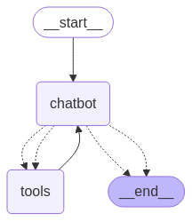

# Financial_Chatbot

## 🔧 Prerequisites

- Python >= 3.10
- Git
- Virtualenv
- OpenAI API Key
- PostgreSQL or MySQL setup (for SQL storage)

## 🚀 Techstack 

**🐍 Backend** 
1. Python >= 3.10
2. FastAPI – Web framework for building APIs
3. LangChain – Framework for developing LLM-powered applications
4. OpenAI API – For LLM-based response generation
5. FAISS – Vector database for semantic search and document similarity
6. PostgreSQL / MySQL – For structured data storage (SQL)
7. SQLAlchemy – ORM for SQL database integration
8. Pydantic – For data validation
9. Uvicorn – ASGI server to run FastAPI apps
10. python-dotenv – To manage environment variables from .env
11. pandas / openpyxl – For processing CSV and Excel files
12. logging – For system logging

**📊 Data Handling**
1. PDF / Text / CSV / Excel – Document types supported for ingestion
2. BeautifulSoup / Requests – For scraping and extracting data from URLs
3. Custom tools for:
`Vector DB Tool`
`SQL DB Tool`
`Agent-based routing between tools`

**🤖 Agent Architecture**
1. LangChain Agents – Handle complex queries by dynamically choosing the right tool (SQL / Vector search)
2. Custom Tools – Integrated tools for SQL + VectorDB
3. LangSmith (Optional) – For tracing and debugging agent runs

    

**🌐 Frontend**
1. Streamlit – Interactive UI for uploading documents and chatting with data

**🔐 Environment Variables (.env)**
1. OPENAI_API_KEY – OpenAI access
2. LANGSMITH_API_KEY – (Optional) for LangSmith observability
3. DB_URI – SQL Database URI (postgresql+psycopg2://... or mysql+mysqlconnector://...)
4. DB_PATH – Path for vector DB
5. UPLOAD_DIR – Upload and storage path for documents


## ✨ Features

- Upload documents (PDF, TXT, CSV, Excel, URL)
- Extract and store data in SQL and Vector DB
- Ask questions from uploaded or extracted data
- Agent architecture to choose between SQL or Vector search
- Web UI built with Streamlit


## How to use 

- **Clone github repository for get full project source code `https://github.com/pratikrathod08/Financial_Chatbot.git`**

- **Clone via git or download zip and store to local folder.** 

- **Go to main folder you will see backend and frontend folders.** 

- **Go to backend root folder.**

`Open Terminal and got to directory of application and move to backend folder `
```bash 
cd backend
```

## Create VENV

```bash 
python -m venv venv 
```

- **Activate venv** 
```bash 
venv\scripts\activate  ## For windows
source venv/bin/activate  ## For linux
```

## Install requirements 

```bash 
pip install -r requirements.txt
```

- **Go to backend root folder.**

`Run below command to terminal `
```bash  
deactivate  ## For deactivate backend venv
```

```bash
cd ..  ## For come back in root folder
```

```bash 
cd frontend  ## Go to frontend folder
```

```bash  
python -m venv venv1  ## Install frontend lib like streamlit 
```

```bash 
venv1\scripts\activate  ## For windows
source venv1/bin/activate  ## For linux
```

```bash 
pip install -r requirements.txt  ## Install frontend dependencies
```

- **Create .env to backend folder and store below secret credentials** 
```bash
OPENAI_API_KEY=""  ## Put here your openai api key
UPLOAD_DIR="app/data/uploads"  ## Upload directory to store data
LANGSMITH_TRACING="true"
LANGSMITH_API_KEY=""  ## Langsmith key for tracing and observability
DB_PATH="app/faiss_index"  ## Vector db path
DB_URI=""  ## Sql database uri

```

- **Sample URI for mysql** 
`mysql+mysqlconnector://{user}:{password}@{host}/{database}`

- **Sample URI for postgres-sql**

- **Remember you need to install `psycopg2-binary` to use postgres sql.**

`postgresql+psycopg2://{user}:{password}@{host}:{port}/{database_name}`

- **Go to backend folder and run application**
`Make sure to activate virtual environment before run application`
```bash 
uvicorn app.main:app --reload  ## Your app will run on localhost:8000 port
```

- **Go to frontend folder and run application**
`Make sure to activate virtual environment before run application`
```bash 
streamlit run app.py  ## You will get frontend url from terminal after run app 
```

- **Go to the frontend url and browse your files and upload you will get success message after successfully upload all files.** 

- **Ask your question from uploaded data.** 

- **Check logs for uploaded files and chat history from `UPLOAD_DIR=app/data/uploads` this path.**
- **Also check logs for error and success from log folder inside backend folder.**

### Test with sample files and url 

- **sample pdf and csv file**
`backend/docs/sampledata` 

- **sample url**

`https://www.nse.co.ke/dataservices/market-statistics/`

## 📄 License


## 👨‍💻 Author

- **Pratik Rathod** – [GitHub](https://github.com/pratikrathod08)
